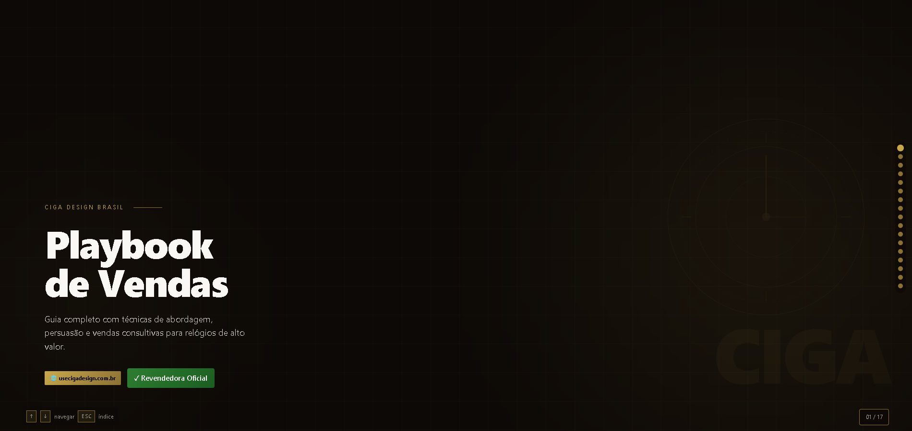
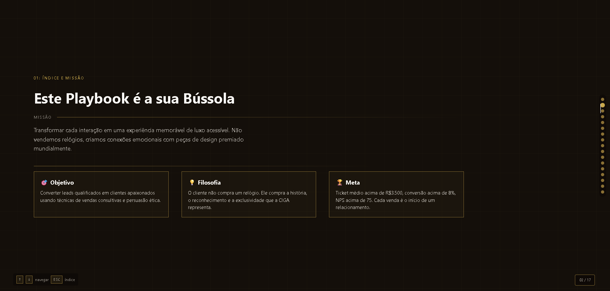

# CIGA Design - Playbook de Vendas ⌚

  
  

Este é um **Playbook de Vendas Interativo** desenvolvido para a CIGA Design Brasil. O projeto funciona como uma apresentação digital ("deck" de slides) voltada para o treinamento e consulta rápida de vendedores e representantes da marca. 

Ele consolida o DNA da marca, técnicas de abordagem, roteiros de pós-venda, tratativas de objeções e scripts prontos para diferentes canais de comunicação, tudo em uma interface de luxo, responsiva e de fácil navegação.

## 📁 Estrutura do Projeto

O projeto foi construído com tecnologias web padrão (Vanilla Web) para garantir máxima compatibilidade, leveza e facilidade de manutenção, sem a necessidade de frameworks complexos. É composto por três arquivos principais:

### 1. `index.html` (A Estrutura e o Conteúdo)
É o coração do Playbook. Ele contém toda a semântica e os textos da apresentação, divididos em `<section class="slide">`. 
* **Navegação Fixa:** Inclui um modal de Índice (acionado pela tecla `ESC`), um contador de slides e "dots" de navegação lateral.
* **Conteúdo Modular:** O playbook possui 16 slides que cobrem toda a jornada de vendas:
  * Missão e DNA da marca.
  * Garantias da Revendedora Oficial.
  * Técnicas de Abordagem (Rapport, Espelhamento) e Qualificação (Método BANT).
  * Argumentos para Objeções complexas (Preço, Confiança, Hesitação).
  * 6 Técnicas de Fechamento High Ticket.
  * Políticas de Pagamento e contorno de bloqueios de cartão.
  * Timeline de Pós-venda e retenção.
  * Scripts prontos para WhatsApp, Instagram e E-mail.
  * Tabela de KPIs e Metas.

### 2. `style.css` (O Design System)
Responsável pela identidade visual do projeto, focado em transmitir um aspecto de "Luxo Acessível" e design arrojado, combinando com os relógios da CIGA Design.
* **Design Tokens:** Uso extensivo de variáveis CSS (`:root`) para manter a consistência de cores (tema escuro com detalhes em dourado) e tipografia.
* **Layout Responsivo:** Utilização de Flexbox e CSS Grid para garantir que o playbook seja perfeitamente legível tanto em monitores ultrawide quanto em telas de celulares.
* **Componentes Visuais:** Estilos modulares para "Cards", "Caixas de Script", "Caixas de Objeções" e "Timelines".
* **Animações (Reveal):** Classes utilitárias (`.rv`, `.d1`, `.d2`, etc.) que criam o efeito de surgimento suave dos elementos na tela conforme o usuário navega.

### 3. `javascript.js` (A Interatividade)
Controla a lógica de navegação e as animações de entrada dos elementos usando JavaScript puro, encapsulado em uma classe `Deck`.
* **Intersection Observer:** A grande "mágica" do código. Ele monitora qual slide está visível na tela (configurado com um `threshold` otimizado para telas longas) para disparar as animações de CSS e atualizar o contador e os marcadores laterais.
* **Navegação Multicanal:** * **Teclado:** Navegação via setas (`↑` e `↓`) e barra de espaço.
  * **Touch:** Suporte a "Swipe" (deslizar o dedo para cima ou para baixo) para uso em tablets e smartphones.
  * **Atalhos:** Tecla `ESC` para abrir/fechar o Índice geral.

## 🚀 Como Executar

Por ser um projeto estático, não há necessidade de build, compilação ou instalação de pacotes (Node.js/NPM).

1. Faça o clone deste repositório ou o download dos arquivos.
2. Abra o arquivo `index.html` diretamente em qualquer navegador moderno (Chrome, Edge, Safari, Firefox).
3. Navegue usando as setas do teclado, o scroll do mouse ou tocando na tela (mobile).

## 🛠️ Tecnologias Utilizadas

* **HTML5:** Semântica e estrutura.
* **CSS3:** Estilização, variáveis nativas, Grid/Flexbox e transições.
* **JavaScript (ES6+):** Lógica orientada a objetos (Classes), Intersection Observer API e manipulação de DOM.
